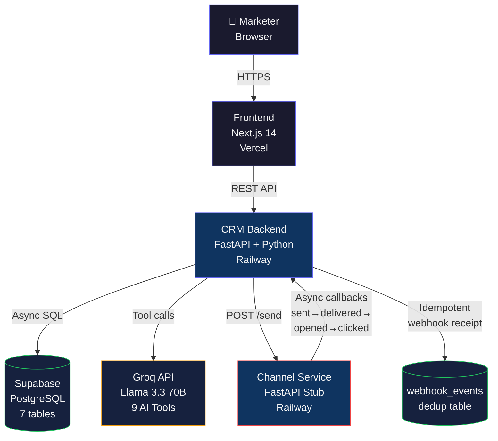

# ZURI CRM — AI-Native Mini CRM
### Built for Xeno Engineering Take-Home Assignment | Forward Deployed Engineer

> **"AI drives, human approves."** — An AI-native CRM where the AI proactively
> surfaces marketing opportunities, executes campaigns end-to-end, and only fires
> with human confirmation.

**Live Demo:** [https://zuri-crm.vercel.app](https://zuri-crm.vercel.app)
**Backend API:** [https://your-backend.railway.app/docs](https://your-backend.railway.app/docs)
**Walkthrough Video:** [Link to video]

---

## The Product

ZURI CRM is an AI-native marketing engagement platform built for ZURI — a fictional
Indian D2C women's fashion brand. It helps brand marketers decide who to talk to,
what to say, and reach them across WhatsApp, SMS, Email, and RCS.

The AI copilot is not a chatbot bolted onto the side. It is the brain of the CRM —
it proactively analyzes 250 customers and 1,094 orders, surfaces opportunities before
you ask, and executes full campaigns end-to-end when you say go.

---

## Architecture



### Three Separately Deployed Services

| Service | Stack | Platform | Purpose |
|---------|-------|----------|---------|
| CRM Backend | FastAPI + SQLAlchemy async | Railway | Business logic, AI agent, segment engine |
| Channel Service | FastAPI stub | Railway | Simulates WhatsApp/SMS/Email/RCS delivery |
| Frontend | Next.js 14 + TypeScript | Vercel | Marketing dashboard + AI copilot UI |

---

## The Channel Service — Callback Loop

The channel service mirrors how real messaging platforms (Twilio, WhatsApp Business API)
work. It does not deliver anything — it simulates outcomes asynchronously.

```
CRM Backend                    Channel Service
     │                               │
     │── POST /send ────────────────>│
     │<── 202 Accepted (immediate) ──│
     │                               │
     │                    [Background Task per message]
     │                               │
     │<── callback: "sent" ─────────│  (1-4 sec delay)
     │<── callback: "delivered" ────│  (3-12 sec) [92% probability]
     │<── callback: "opened" ───────│  (15-60 sec) [55% probability]
     │<── callback: "clicked" ──────│  (30-120 sec) [30% probability]
     │<── callback: "converted" ────│  (60-300 sec) [12% probability]
     │         OR
     │<── callback: "failed" ───────│  (8% probability)
```

**System design considerations implemented:**
- **Idempotency**: `webhook_events` table with `UNIQUE(communication_id, event_type)` prevents double-counting
- **State machine**: Communications only move forward (pending→sent→delivered→opened→clicked→converted). Invalid transitions silently ignored.
- **Retry logic**: Channel service retries callbacks 3 times with exponential backoff (2s, 4s, 8s)
- **Volume**: FastAPI BackgroundTasks for demo scale. At production scale → Redis Streams or Kafka workers.
- **Atomic updates**: `campaign_analytics` uses `SET total_delivered = total_delivered + 1` to prevent race conditions

---

## AI Copilot — How It Works

The AI copilot uses **Groq (Llama 3.3 70B)** with OpenAI-compatible tool calling.

### 9 Tools Available to the Agent

| Tool | What it does |
|------|-------------|
| `get_dashboard_summary` | Real-time CRM state — customer counts, campaign performance |
| `get_proactive_opportunities` | Analyzes customer base for lapsed, at-risk, uncontacted segments |
| `query_customers` | Queries customers with behavioral/demographic filters before segmenting |
| `create_segment` | Saves a named segment to DB from natural language description |
| `get_segment_insights` | Deep analytics — spend distribution, city breakdown, channel preference |
| `suggest_best_channel` | Analyzes segment's preferred channels + historical performance |
| `create_and_launch_campaign` | Creates campaign + launches it (requires `confirmed=true`) |
| `get_campaign_analytics` | Performance data for any campaign |
| `get_existing_segments` | Lists all saved segments to avoid duplication |

### The Agentic Loop

```python
while True:
    response = groq.chat.completions.create(model=MODEL, messages=messages, tools=TOOLS)
    if response.choices[0].finish_reason == "stop":
        return response.choices[0].message.content  # Final answer
    elif response.choices[0].finish_reason == "tool_calls":
        # Execute all tool calls against real database
        # Append results, continue loop
```

### Proactive Intelligence

On copilot panel load (before the marketer types anything), the system calls
`GET /api/ai/insights` which runs 5 real-time analyses:
1. Lapsed customer count (90+ days no purchase)
2. At-risk customer count (60-90 days)
3. Uncontacted high-value customers (Gold/Platinum never messaged)
4. Disengaged champions (Platinum, 45+ days quiet)
5. Campaign performance trend (improving/declining/stable)

Returns 3-4 actionable opportunity cards with "Quick Launch" buttons.

---

## Data Model

```
customers ──< orders
customers ──< communications >── campaigns >── segments
campaigns ──< campaign_analytics
communications ──< webhook_events
```

**250 customers** | **1,094 orders** | **6 segments** | **3 historical campaigns** | **798 webhook events**

Customer tiers derived from RFM analysis:
- **Platinum**: spend > ₹20,000 OR orders ≥ 10
- **Gold**: spend > ₹8,000 OR orders ≥ 5
- **Silver**: spend > ₹2,000 OR orders ≥ 3
- **Bronze**: everything else

---

## Segment Engine

The segment engine translates filter rules JSON into safe, parameterized SQL at query time.

```json
{
  "operator": "AND",
  "conditions": [
    {"field": "last_purchase_at", "operator": "days_ago_gte", "value": 90},
    {"field": "tier", "operator": "in", "value": ["gold", "platinum"]},
    {"field": "total_spend", "operator": "gte", "value": 5000}
  ]
}
```

**Tradeoff**: On-demand evaluation is correct for demo scale (<10k customers).
At production scale → pre-compute segment membership into a `customer_segment_memberships`
table with scheduled refresh.

---

## Conscious Tradeoffs

| Decision | What I did | What I'd do at scale |
|----------|-----------|---------------------|
| Background tasks | FastAPI BackgroundTasks | Redis Streams / Kafka workers |
| Segment evaluation | On-demand SQL query | Pre-computed membership table |
| DB connection | Supabase transaction pooler (NullPool) | Dedicated PostgreSQL with PgBouncer |
| AI model | Groq Llama 3.3 70B (free tier) | Claude Opus or GPT-4o for higher reasoning |
| Analytics | Denormalized `campaign_analytics` table | Event sourcing with streaming aggregation |
| Auth | None (demo scope) | JWT + RBAC for multi-brand tenancy |

---

## Project Structure

```
xeno-mini-crm/
├── backend/                    # CRM Service (FastAPI)
│   ├── models/                 # SQLAlchemy 2.0 ORM models
│   ├── schemas/                # Pydantic v2 request/response schemas
│   ├── routers/                # FastAPI route handlers (7 routers)
│   ├── services/
│   │   ├── ai_agent.py         # Groq integration + 9 tool executors + agentic loop
│   │   ├── segment_engine.py   # Dynamic SQL builder from filter rules
│   │   ├── campaign_launcher.py # Dispatches to channel service
│   │   └── message_renderer.py # Personalizes templates per customer
│   ├── db/
│   │   ├── schema.sql          # All 7 table definitions
│   │   └── seed.py             # 250 customers + 1094 orders generator
│   └── utils/
│       └── idempotency.py      # Webhook dedup logic
├── channel-service/            # Channel Stub Service (FastAPI)
│   ├── services/
│   │   ├── simulator.py        # Async probability-tree callback simulator
│   │   └── retry_handler.py    # Exponential backoff retry
│   └── routers/send.py         # POST /send endpoint
└── frontend/                   # Next.js 14 Dashboard
    ├── app/                    # App Router pages
    ├── components/
    │   ├── ai-copilot/         # CopilotPanel, InsightCard, ChatMessage
    │   ├── dashboard/          # MetricsGrid, RecentCampaigns
    │   ├── campaigns/          # CampaignCard, AnalyticsChart, LaunchModal
    │   ├── customers/          # CustomerTable with search/filter/paginate
    │   └── segments/           # SegmentCard, SegmentBuilder
    └── lib/
        ├── api.ts              # All API calls
        └── types.ts            # TypeScript interfaces
```

---

## Local Setup

### Prerequisites
- Python 3.11+
- Node.js 18+
- Supabase account (free)
- Groq account (free)

### 1. Database Setup
```bash
# Set DATABASE_URL in backend/.env
# Run schema + seed
cd backend
pip install -r requirements.txt
cd db
python seed.py
```

### 2. Backend
```bash
cd backend
# Create .env from .env.example and fill in values
python -m uvicorn main:app --reload --port 8000
# Visit http://localhost:8000/docs
```

### 3. Channel Service
```bash
cd channel-service
pip install -r requirements.txt
# Create .env from .env.example
python -m uvicorn main:app --reload --port 8001
```

### 4. Frontend
```bash
cd frontend
npm install
# Create .env.local with NEXT_PUBLIC_API_URL=http://localhost:8000
npm run dev
# Visit http://localhost:3000/dashboard
```

---

## Environment Variables

### Backend
| Variable | Description |
|----------|-------------|
| `DATABASE_URL` | Supabase PostgreSQL connection string |
| `GROQ_API_KEY` | Groq API key (free at console.groq.com) |
| `CHANNEL_SERVICE_URL` | URL of the channel service |
| `CRM_WEBHOOK_URL` | URL of this backend (for channel service callbacks) |

### Channel Service
| Variable | Description |
|----------|-------------|
| `CRM_WEBHOOK_URL` | URL of CRM backend webhook endpoint |
| `DEMO_MODE` | `true` = all delays 1-3 seconds for live demo |

### Frontend
| Variable | Description |
|----------|-------------|
| `NEXT_PUBLIC_API_URL` | URL of CRM backend |

---

## API Documentation

Full interactive API docs available at `{BACKEND_URL}/docs`

Key endpoints:
- `GET /api/analytics/dashboard` — Real-time dashboard metrics
- `POST /api/segments/preview` — Preview segment without saving
- `POST /api/campaigns/{id}/launch` — Launch campaign to segment
- `POST /api/receipts/webhook` — Channel service callback receiver
- `POST /api/ai/chat` — AI copilot chat with tool execution
- `GET /api/ai/insights` — Proactive opportunity cards

---

## AI-Native Development Workflow

This product was built using an AI-native SDLC:

1. **Architecture designed with Claude** — data model, API contracts, channel service lifecycle
2. **OpenAI Codex (GPT-5.5)** — bulk implementation: models, schemas, routers, frontend components
3. **Claude Opus (Antigravity IDE)** — complex reasoning: async callback loop, segment engine, AI agent tool design
4. **Review-first approach** — every AI-generated file reviewed before commit; nothing ships unreviewed

The AI wrote the implementation. I made the decisions, reviewed the output, and owned the architecture.

---

## About the Candidate

**Soham Bhattacharya** | B.Tech CSE, SRM IST | CGPA 9.1 | Batch 2027
Applying for: **Forward Deployed Engineer Intern** at Xeno

Relevant experience: Built JADE ASSURE (production AI/SaaS for international fintech client),
shipped Unizo to Apple App Store, Infosys iOS SDE intern.

---

*Built with ❤️ for Xeno Engineering Take-Home Assignment | June 2026*
